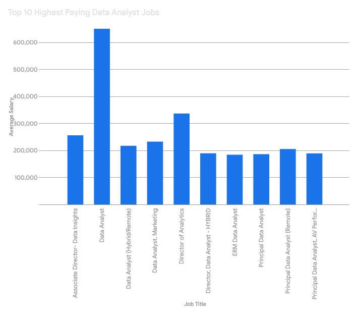
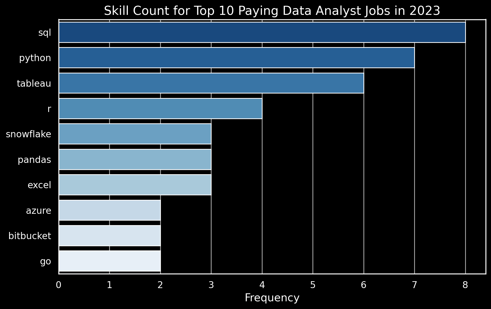

# Introduction
📊 Explore the data job market! This project focuses on data analyst roles, highlighting 💰 high-paying jobs, 🔥 in-demand skills, and 📈 the intersection of demand and salary within the data analytics field.

🔍 Want to see my SQL queries? Check them out in the [project_sql folder](/project_sql/).
# Background

Motivated by the need to better understand the data analyst job market, this project aims to identify high-paying roles and in-demand skills. The goal is to streamline job seekers’ efforts in finding optimal opportunities.

The data comes from my SQL course and includes valuable insights into job titles, salaries, locations, and required skills.

### Key questions explored through my SQL queries include:

* What are the highest-paying data analyst positions?
* What skills are needed for these top-paying roles?
* Which skills are most in demand for data analysts?
* How are certain skills linked to higher salaries?
* Which skills should aspiring data analysts prioritize learning?

# Tools I used
To dive deep into the data analyst job market, I utilized several key tools:

* SQL : The core of my analysis, enabling me to query the database and extract valuable insights.
* PostgreSQL: A robust database management system perfect for handling the job posting data.
* Visual Studio Code: My preferred editor for managing the database and running SQL queries.
* Git & GitHub: Crucial for version control, sharing SQL scripts, and tracking project progress.

# The Analysis
Each query in this project was designed to explore a specific aspect of the data analyst job market. Here's how I tackled each question:

### Top-Paying Data Analyst Jobs
To uncover the highest-paying roles, I filtered data analyst positions based on average yearly salary and location, with a focus on remote opportunities. This query highlights lucrative positions in the field, providing insights into where the most competitive salaries are offered.

```sql
SELECT 
    job_id,
    job_title,
    job_location,
    job_schedule_type,
    salary_year_avg,
    job_posted_date,
    name AS company_name
FROM 
    job_postings_fact
LEFT JOIN company_dim ON job_postings_fact.company_id = company_dim.company_id
WHERE
    job_location = 'Anywhere' 
    AND job_title_short = 'Data Analyst'
    AND salary_year_avg IS NOT NULL
ORDER BY salary_year_avg DESC
LIMIT 10
```
### Key Findings from Top 10 Data Analyst Roles in 2023:

* Significant Salary Range: Salaries for top data analyst positions spanned a wide range in 2023, from $184,000 to a remarkable $650,000 per year, highlighting the substantial earning potential within the field.
* Diverse Hiring Landscape: A variety of prominent companies, including SmartAsset, Meta, and AT&T, were among the top employers, demonstrating strong demand for data analysts across diverse industries.
* Varied Career Paths: The analysis revealed a diverse range of job titles, from entry-level Data Analyst positions to more senior roles like Director of Analytics, indicating a wide spectrum of career paths and specialization opportunities within the data analytics domain.


 A bar graph visualizing the salaries for the top 10 data analyst roles, generated by Gemini based on SQL query results, provides a clear visual representation of this data.

### 2. Skills for Top-Paying Jobs
To identify the skills most valued in high-compensation roles, I combined job postings data with skills data. This analysis reveals the key competencies employers prioritize for top-paying positions.

```sql
WITH top_paying_job AS (
    SELECT 
        job_id,
        job_title,
        salary_year_avg,
        name as company_name
    FROM 
        job_postings_fact
    LEFT JOIN company_dim ON job_postings_fact.company_id = company_dim.company_id
    WHERE
        job_location = 'Anywhere' 
        AND job_title_short = 'Data Analyst'
        AND salary_year_avg IS NOT NULL
    ORDER BY salary_year_avg DESC
    LIMIT 10
    )
    SELECT 
        top_paying_job.*,
        skills
    FROM top_paying_job
    INNER JOIN skills_job_dim ON top_paying_job.job_id = skills_job_dim.job_id
    INNER JOIN skills_dim ON skills_job_dim.skill_id = skills_dim.skill_id
    ORDER BY
        salary_year_avg DESC
```
### Key Findings
Breakdown of the Most In-Demand Skills for the Top 10 Highest-Paying Data Analyst Jobs in 2023:

* SQL leads the pack, being required in 8 out of 10 job postings.
* Python follows closely, appearing in 7 out of 10 job postings.
* Tableau is also highly sought after, with a presence in 6 out of 10 job postings.
* Other skills like R, Snowflake, Pandas, and Excel show varying levels of demand across these roles.



A bar graph visualizing the salaries for the top 25 data analyst roles, generated by ChatGPT based on SQL query results, provides a clear visual representation of this data.

### 3. Top In-Demand Skills for Data Analysts**
This query identifies the skills most commonly requested in job postings, highlighting areas with the highest demand.

```sql
SELECT 
    skills,
    COUNT(skills_job_dim.job_id) AS demand_count
FROM job_postings_fact
INNER JOIN skills_job_dim ON job_postings_fact.job_id = skills_job_dim.job_id
INNER JOIN skills_dim ON skills_job_dim.skill_id = skills_dim.skill_id
WHERE 
    job_title_short = 'Data Analyst'
GROUP BY 
    skills
ORDER BY 
    demand_count DESC
LIMIT 5
```

Here’s an overview of the most demanded skills for data analysts in 2023:

- **SQL** and **Excel** continue to be foundational, underscoring the importance of strong data processing and spreadsheet skills.
- **Programming** and **Visualization Tools** such as **Python**, **Tableau**, and **Power BI** are increasingly crucial, reflecting the growing role of technical skills in data analysis, storytelling, and decision-making.

### Top 5 In-Demand Skills for Data Analysts:

| Skill       | Demand Count |
|-------------|--------------|
| SQL         | 7291         |
| Excel       | 4611         |
| Python      | 4330         |
| Tableau     | 3745         |
| Power BI    | 2609         |

### 4. Skills Based on Salary
Analyzing the average salaries linked to various skills revealed which skills offer the highest earning potential.

```sql
SELECT 
    skills,
    ROUND(AVG(salary_year_avg), 0) AS avg_salary
FROM job_postings_fact
INNER JOIN skills_job_dim ON job_postings_fact.job_id = skills_job_dim.job_id
INNER JOIN skills_dim ON skills_job_dim.skill_id = skills_dim.skill_id
WHERE 
    job_title_short = 'Data Analyst' AND
    salary_year_avg IS NOT NULL 
     --job_work_from_home = TRUE
GROUP BY 
    skills
ORDER BY 
    avg_salary DESC
LIMIT 25
```
### Here’s an overview of the top-paying skills for Data Analysts:

1. **Big Data & Machine Learning Expertise**: Skills in big data tools like PySpark and Couchbase, along with machine learning platforms like DataRobot and Python libraries such as Pandas and NumPy, lead to the highest salaries. These reflect the industry's emphasis on advanced data processing and predictive modeling capabilities.  

2. **Software Development & Deployment Knowledge**: Proficiency in tools like GitLab, Kubernetes, and Airflow highlights a lucrative blend of data analysis and engineering, with premium salaries for skills that enable automation and efficient data pipeline management.  

3. **Cloud Computing Proficiency**: Experience with cloud platforms and data engineering tools like Elasticsearch, Databricks, and Google Cloud Platform (GCP) showcases the value of cloud-based analytics environments, significantly boosting earning potential.  

| **Skill**       | **Average Salary ($)** |
|------------------|------------------------|
| PySpark          | 208,172               |
| Bitbucket        | 189,155               |
| Couchbase        | 160,515               |
| Watson           | 160,515               |
| DataRobot        | 155,486               |
| GitLab           | 154,500               |
| Swift            | 153,750               |
| Jupyter          | 152,777               |
| Pandas           | 151,821               |
| Elasticsearch    | 145,000               |

This table highlights the average salaries associated with the top 10 highest-paying skills for data analysts.

### 5. Most Optimal Skills to Learn  
This analysis combines demand and salary data to identify skills that are both highly sought after and command high salaries, providing a strategic roadmap for skill development.

By focusing on these optimal skills, aspiring data analysts can maximize their employability while targeting lucrative opportunities in the industry.

```sql
SELECT 
    skills_dim.skill_id,
    skills_dim.skills,
    COUNT(skills_job_dim.job_id) AS demand_count,
    ROUND(AVG(job_postings_fact.salary_year_avg), 0) AS avg_salary
FROM 
    job_postings_fact
INNER JOIN 
    skills_job_dim ON job_postings_fact.job_id = skills_job_dim.job_id
INNER JOIN 
    skills_dim ON skills_job_dim.skill_id = skills_dim.skill_id
WHERE 
    job_postings_fact.job_title_short = 'Data Analyst' 
    AND job_postings_fact.salary_year_avg IS NOT NULL 
    AND job_postings_fact.job_work_from_home = TRUE
GROUP BY 
    skills_dim.skill_id
HAVING 
    COUNT(skills_job_dim.job_id) > 10
ORDER BY 
    avg_salary DESC,
    demand_count DESC
LIMIT 25;
```
### Most Optimal Skills for Data Analysts in 2023
The table below highlights the top skills for data analysts, ranked by salary and demand, providing a roadmap for strategic skill development.

| Skill ID | Skills      | Demand Count | Average Salary ($) |
|----------|-------------|--------------|---------------------|
| 8        | Go          | 27           | 115,320             |
| 234      | Confluence  | 11           | 114,210             |
| 97       | Hadoop      | 22           | 113,193             |
| 80       | Snowflake   | 37           | 112,948             |
| 74       | Azure       | 34           | 111,225             |
| 77       | BigQuery    | 13           | 109,654             |
| 76       | AWS         | 32           | 108,317             |
| 4        | Java        | 17           | 106,906             |
| 194      | SSIS        | 12           | 106,683             |
| 233      | Jira        | 20           | 104,918             |

---

### Breakdown of the Most Optimal Skills

1. **High-Demand Programming Languages**  
   Programming languages such as Python and R remain in high demand, with demand counts of 236 and 148, respectively. However, their average salaries ($101,397 for Python and $100,499 for R) suggest that these skills are widely available, making them essential but competitive in the job market.

2. **Cloud Tools and Technologies**  
   Specialized tools like Snowflake, Azure, AWS, and BigQuery demonstrate strong demand and offer competitive salaries. These skills highlight the growing importance of cloud platforms and big data technologies in the analytics field.

3. **Business Intelligence and Visualization Tools**  
   Tools such as Tableau and Looker, with average salaries of $99,288 and $103,795, respectively, underline the importance of data visualization and business intelligence in transforming data into actionable insights.

4. **Database Technologies**  
   Expertise in database management tools such as Oracle, SQL Server, and NoSQL remains vital, with average salaries ranging from $97,786 to $104,534. These skills are foundational for data storage, retrieval, and management.

Focusing on these high-paying, in-demand skills can help data analysts enhance their career prospects and align with industry trends.
# What I learned
This project supercharged my SQL skills and equipped me with valuable insights into data analysis and the job market:

🧩 Complex Query Crafting: I mastered advanced SQL techniques, including efficient table joins and utilizing WITH clauses for creating temporary tables like a pro.

📊 Data Aggregation: I became adept at using GROUP BY along with aggregate functions like COUNT() and AVG() to summarize and analyze data effectively.

💡 Analytical Wizardry: I leveled up my ability to transform real-world questions into actionable, insightful SQL queries, unlocking data-driven solutions.

# Concusion
## Key Insights
1. Top-Paying Data Analyst Jobs: Remote data analyst positions offer a wide salary range, with the highest-paying roles reaching up to $650,000!
2. Skills for Top-Paying Jobs: Proficiency in advanced SQL is a common denominator for securing these high-paying positions, marking it as a critical skill.
3. Most In-Demand Skills: SQL leads the pack as the most in-demand skill, cementing its status as a must-have for job seekers in the field.
4. Skills with Higher Salaries: Specialized skills, such as SVN and Solidity, command the highest average salaries, reflecting the premium placed on niche technical expertise.
5. Optimal Skills for Market Value: SQL not only dominates in demand but also boasts a high average salary, making it one of the most optimal skills for aspiring data analysts to learn.

## Closing Thoughts
This project enhanced my SQL expertise while uncovering valuable insights into the data analyst job market. The findings emphasize the importance of focusing on high-demand, high-salary skills to stay competitive. For aspiring data analysts, prioritizing SQL and other specialized tools is key to career advancement.

Through this journey, I’ve not only sharpened my technical abilities but also deepened my understanding of the evolving trends in data analytics. Continuous learning and adapting to emerging technologies remain essential for standing out in this dynamic field.